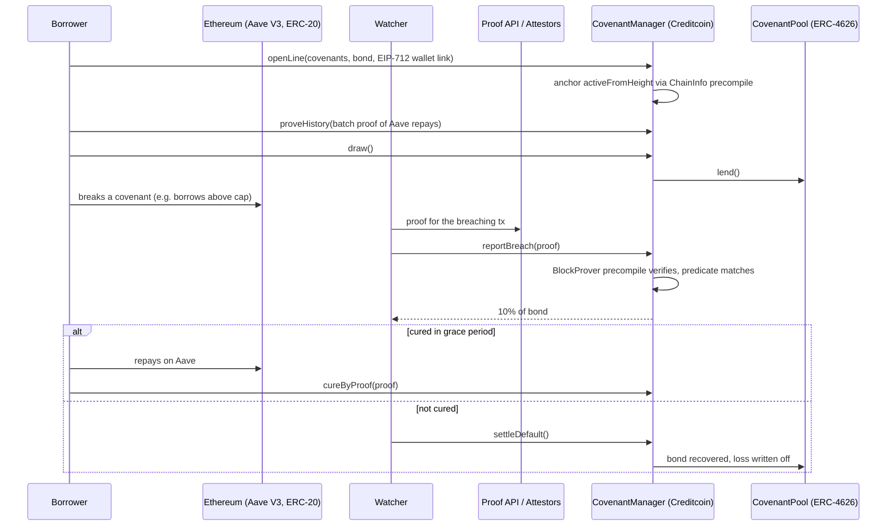

# Covenant

**Collateral buys 1x. Covenants buy the rest.**

Covenant is an under-collateralized credit rail on Creditcoin. A borrower posts a bond and accepts loan covenants over their Ethereum wallet. If the wallet breaks a covenant on Ethereum, anyone can prove it on Creditcoin with an Attestcoin inclusion proof, freeze the line, and collect a bounty from the bond. No oracle decides whether a breach happened. The contract verifies the Ethereum transaction itself.

Live on Creditcoin testnet. Contracts verified on Blockscout.

- **App:** [covenant-credit.vercel.app](https://covenant-credit.vercel.app) (read-only, no wallet needed)
- **Demo video:** [youtu.be/KZIEI-UwHE8](https://youtu.be/KZIEI-UwHE8)
- **Deck:** [docs/covenant-deck.pdf](docs/covenant-deck.pdf)
- **Proof log:** [PROOF.md](PROOF.md)

## Why covenants

Cross-chain credit scores let a borrower prove good behaviour: repayments, deposits, positions. The borrower chooses which transactions to prove. An inclusion proof shows that something happened and can never show that something did not happen, so bad history stays hidden. That is a résumé, not a credit report.

Banks solved this long ago with covenants. The borrower promises not to do specific things, and each broken promise is an observable event. On Ethereum those events are transactions, which the Attestcoin Protocol makes provable on Creditcoin. Covenant flips the burden: the borrower gets credit for accepting monitoring, and the whole network is paid to monitor.

| Covenant | Breach event proven from Ethereum | Limit weight |
|---|---|---|
| `CROSS_DEFAULT` | Aave V3 `LiquidationCall` with `user` = linked wallet | +1.00x |
| `DEBT_CAP` | Aave V3 `Borrow` on behalf of the wallet above a threshold | +0.75x |
| `NEGATIVE_PLEDGE` | ERC-20 `Transfer` out of the wallet above a threshold | +0.50x |
| Proven repayment history | Aave V3 `Repay` by the wallet, batch-proven | +0.25x each, max +1.00x |

`limit = bond × (1 + weights + history)`, hard-capped at 4x the bond.

## How it works



Every rejection is a revert: replayed proof, spoofed emitter, wrong wallet, event older than the covenant, failed source transaction, verifier false, threshold not exceeded, cure after the grace period. See [docs/ATTESTCOIN.md](docs/ATTESTCOIN.md) for the full Attestcoin integration.

## Deployed contracts (Creditcoin testnet, chainId 102031)

| Contract | Address |
|---|---|
| CovenantManager | [`0xB828ec5068B3b89bdbdacaafc2b494eAAec990F2`](https://creditcoin-testnet.blockscout.com/address/0xB828ec5068B3b89bdbdacaafc2b494eAAec990F2) |
| CovenantPool (ERC-4626) | [`0xB427b1F87966a80D7e50e57B453E7653c228b8be`](https://creditcoin-testnet.blockscout.com/address/0xB427b1F87966a80D7e50e57B453E7653c228b8be) |
| CreditRecord | [`0x02977ae7C5515EaA562d9353253527226A7f8aA0`](https://creditcoin-testnet.blockscout.com/address/0x02977ae7C5515EaA562d9353253527226A7f8aA0) |
| WCTC | [`0x1F281ACd1199a2798c5B9Fa222b18fCa9ebF3dC1`](https://creditcoin-testnet.blockscout.com/address/0x1F281ACd1199a2798c5B9Fa222b18fCa9ebF3dC1) |
| CovenantEvaluator (library) | [`0x7cecD4d7e2Aaa4667916B6da41a646Cd9229e16C`](https://creditcoin-testnet.blockscout.com/address/0x7cecD4d7e2Aaa4667916B6da41a646Cd9229e16C) |

On-chain proof of every claim is collected in [PROOF.md](PROOF.md).

## Repository

| Path | What |
|---|---|
| `contracts/` | Foundry project: `CovenantManager` (the Attestcoin smart contract), `CovenantPool`, `CreditRecord`, `WCTC`, `CovenantPredicates` / `CovenantEvaluator` libraries, 197 tests |
| `packages/sdk` | TypeScript SDK: proof API client (single, batch, attestation wait), `txBytes` decoder, covenant predicates, wallet scanner, bounded risk memo |
| `packages/cli` | Borrower and watcher CLI: open, history, draw, repay, breach, cure, default, predicate, autonomous `watch`, risk `memo` |
| `apps/web` | Web app: landing, ledger of live lines, pool, proof verifier, watcher feed |
| `docs/` | Attestcoin integration guide, pitch deck |

## Run it

```bash
pnpm install

# contracts
cd contracts && forge test

# sdk
pnpm -F @covenant/sdk test

# web app (reads the live testnet deployment)
pnpm -F web dev
```

Check a real Ethereum mainnet Aave liquidation against the deployed contract, no keys needed:

```bash
node packages/cli/src/cli.mjs predicate cross-default 3 \
  0xde092a220313cede58750434b66d46b5ff494cbb \
  0xec0b8f78036c679ed61d1a3ec1a6d4f733c4a306bfc0b6253cf4e02752883b07
# log 16: CROSS_DEFAULT breach for 0xde09..., amount 3985851340
```

Run an autonomous watcher (needs a funded Creditcoin testnet key). It scans every active line's linked wallet on the source chain, checks candidates with `previewBreach`, and reports only real breaches:

```bash
export COVENANT_PRIVATE_KEY=0x...
node packages/cli/src/cli.mjs watch --interval 30      # or --once for a single pass
node packages/cli/src/cli.mjs breach <lineId> <termIndex> <sepoliaTxHash>   # manual report
```

Generate a risk memo for a wallet and open a line with its hash:

```bash
export VENICE_API_KEY=...
node packages/cli/src/cli.mjs memo <wallet> --out memo.json
node packages/cli/src/cli.mjs open <bond> 1 <reserve> <debtCap> <pledgeToken> <pledgeCap> --memo memo.json
```

| Env | Used by | Purpose |
|---|---|---|
| `COVENANT_PRIVATE_KEY` | cli | signer for borrower, watcher or keeper actions |
| `CREDITCOIN_RPC_URL` | cli | optional RPC override |
| `VENICE_API_KEY` | sdk memo | optional risk memo generation |

## Tests

- 197 Foundry tests across 11 suites, including invariant tests (pool assets equal idle plus outstanding, bonds fully backed, limit never above 4x the bond).
- Fixtures are real proofs: an Ethereum mainnet Aave V3 liquidation, four Sepolia Aave repayments (single and batch), and a Sepolia Aave borrow. Only the precompiles are mocked in unit tests; the decoder and predicates run on real bytes.
- 71 SDK tests on the same fixtures.

## Risk memo

`packages/sdk` can generate a risk memo from a wallet's proven facts and propose covenant thresholds; line 3 on testnet was opened with a live memo and carries its hash on-chain (see [PROOF.md](PROOF.md)). The memo is advisory. Proposed terms outside the contract's ceilings or allowlists are dropped before they reach the user, and the contract stores only the memo hash. Nothing in the memo can raise a limit or loosen a covenant.

## Honest limits

- Covenants bind the linked wallet only. A borrower who takes risk from a different wallet is not observed; the bond and the 4x cap bound that exposure.
- Absence cannot be proven. Covenant never claims a wallet is clean, only that a specific promise was broken.
- Testnet only. Sepolia and Ethereum mainnet are both readable from Creditcoin testnet today; the live demo uses Sepolia so breaches can be triggered on demand, and mainnet data is used for the liquidation check and the test fixtures.
- Fresh source transactions need about six minutes of attestation before they can be proven.
- Interest is simple and accrues per second at a fixed 12% APR. Pool pricing by covenant strength is future work.
- The contracts have not been externally audited.

## License

MIT
